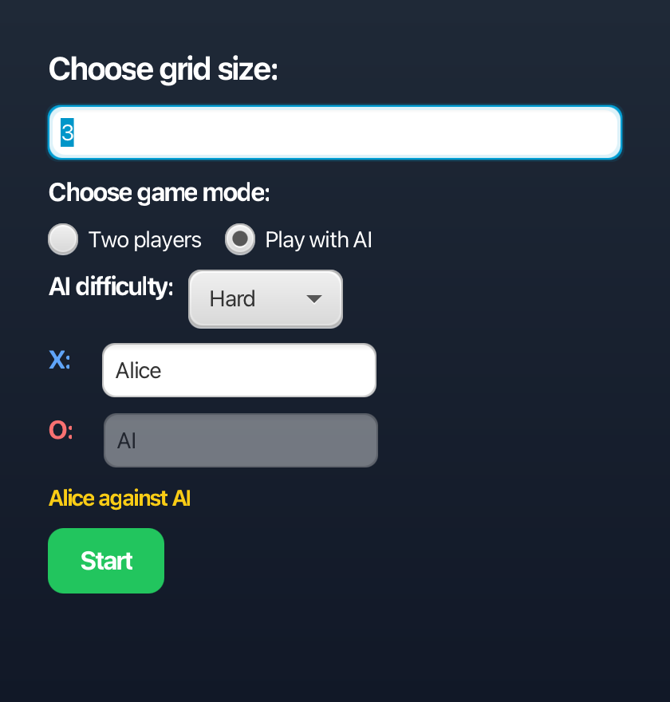
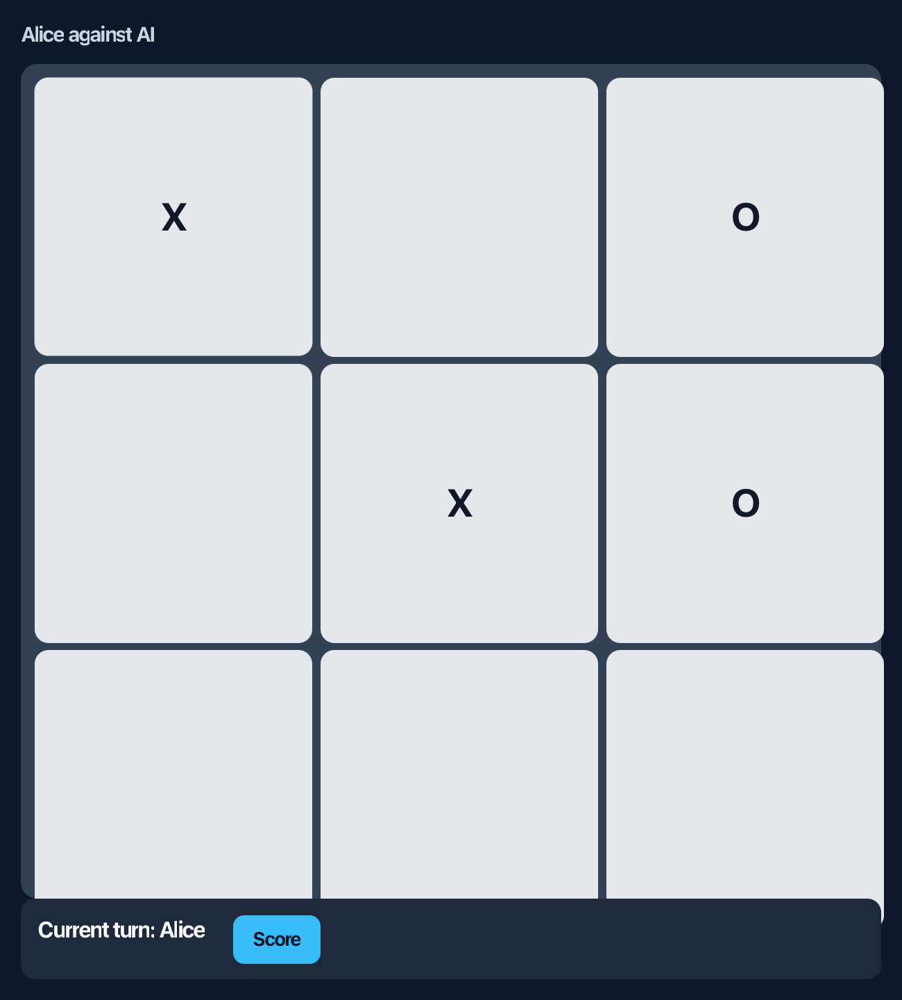
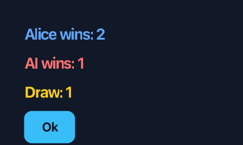

# Tic Tac Toe JavaFX


A JavaFX implementation of Noughts and Crosses with configurable board sizes, score tracking, and three AI difficulty levels.

This project started as a simple desktop game and was refined into a cleaner portfolio project: the interface remains lightweight and familiar, while the game logic and computer player now show stronger Java, JavaFX, algorithmic, and Maven skills.

## Screenshots

<p align="center">
  
  &nbsp;&nbsp;
  
</p>

<p align="center"><em>Game setup with mode and AI difficulty selection (left) and an in-progress match against the AI (right).</em></p>

<p align="center">
  
  &nbsp;&nbsp;
  
</p>

<p align="center"><em>Game-over announcement (left) and running match score (right).</em></p>

## Key Skills Demonstrated

- Java Object-Oriented Programming
- JavaFX GUI Development
- Minimax Search
- Alpha-Beta Pruning
- Algorithm Design
- Unit Testing with JUnit 5
- Maven Build Management
- Separation of UI and Business Logic
## Features

- JavaFX desktop interface with setup, game board, game-over, and score views.
- Human-vs-human and human-vs-AI game modes.
- Configurable board size.
- Player name entry and match score tracking.
- AI difficulty selector with Easy, Medium, and Hard modes.
- Maven workflow for running and testing the project.
- Unit tests for important AI decisions.

## AI Difficulty

| Difficulty | Behaviour |
| --- | --- |
| Easy | Chooses a random legal move. |
| Medium | Takes immediate wins, blocks immediate losses, then prefers stronger board positions. |
| Hard | Uses minimax with alpha-beta pruning on 3x3 boards for optimal play. On larger boards, it switches to heuristic scoring to avoid unnecessary search cost. |

The Hard AI is the main technical feature. Classic 3x3 Tic Tac Toe has a small enough search space for minimax to evaluate future game states properly. Larger boards become much more expensive, so the project uses a scoring heuristic based on open rows, columns, diagonals, threats, and positional value.

## Tech Stack

- Java
- JavaFX
- Maven
- JUnit 5

## Getting Started

### Prerequisites

- JDK 25 recommended
- Maven 3.9 or newer


### Run the Application

```bash
mvn javafx:run
```

If you run the project in IntelliJ IDEA, import it as a Maven project and set the Project SDK to a JDK installation before running the Maven `javafx:run` goal.

### Run Tests

```bash
mvn test
```

## Project Structure

```text
src/main/java/com/george/tictactoe/
  AiDifficulty.java          AI difficulty enum used by the setup screen
  ComputerPlayer.java        AI strategy implementation
  GameBoard.java             Board state, legal moves, winner detection
  NoughtsAndCrossesApp.java  JavaFX application and UI flow

src/test/java/com/george/tictactoe/
  ComputerPlayerTest.java    Focused tests for hard AI decisions
```

## Engineering Highlights

- Separates the computer player from the JavaFX UI so AI behaviour can be tested independently.
- Uses minimax with alpha-beta pruning for the classic board, demonstrating recursive search and pruning.
- Keeps a fallback heuristic for larger boards, showing awareness of algorithmic complexity rather than applying minimax where it does not scale well.
- Uses JavaFX event handling, scene composition, controls, bindings, and styled components.
- Uses Maven for dependency management and reproducible run/test commands.

## Portfolio Notes

This project is designed to be understandable at a glance while still showing meaningful engineering work. It demonstrates:

- Java object-oriented programming.
- JavaFX desktop application development.
- Algorithmic problem solving.
- Testable separation between UI and game logic.
- Basic repository hygiene through a clean package structure and Maven build.
